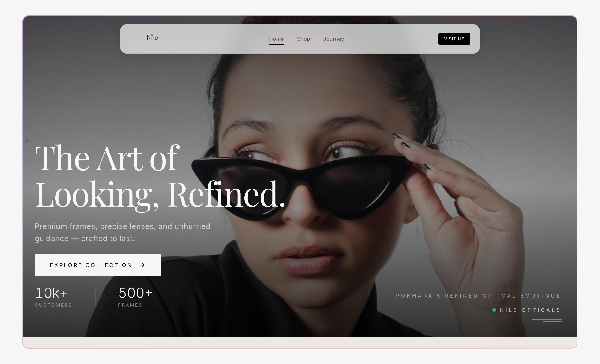

# Nile Opticals

Luxury eyewear landing page for Nile Opticals, New Road, Pokhara.

**[Live Site](https://opticals-nile.vercel.app)**

<p align="center">
  
</p>

## Stack

**Vite · React 19 · TypeScript · Tailwind CSS v4 · Framer Motion · react-router-dom v7**

## Features

- **Product showcase** — 19 frames with hover image swap, organized by category and material
- **Open Graph + Twitter Cards** — 1200×630 preview renders on Facebook, Twitter, WhatsApp, and Messenger
- **Structured data** — LocalBusiness, Product, FAQ, WebSite, and BreadcrumbList JSON-LD for search visibility
- **Framer Motion** — animated hero, counters, accordion, and scroll-reveal transitions
- **Static prerender** — custom ReactDOMServer pipeline bakes SEO meta and JSON-LD into static HTML per route
- **Auto sitemap** — generated at build with all routes and 38 product image extensions
- **Tailwind CSS v4** — no config file, pure CSS‑based theming with `@import`

## Routes

| Path | Page |
|------|------|
| `/` | Home — hero, collection, eyewear types, brand marquee |
| `/shop` | Product grid — 19 frames with details |
| `/journey` | Brand story, gallery, location, contact |
| `/faq` | FAQ accordion |
| `/terms` | Terms & Conditions |

## Getting started

```bash
npm install
npm run dev       # → localhost:5173
npm run build     # → dist/
```

## Project structure

```
src/
├── components/   Hero, Footer, ProductCard, BrandMarquee …
├── pages/        App (home), Shop, Journey, FAQ, Terms
├── data/         products.ts — 19 product entries
├── hooks/        useInView
└── Seo.tsx       unified SEO helper + JSON-LD generators
scripts/
├── prerender.tsx     ReactDOMServer static generation
└── generate-sitemap.mjs

---

© 2026 Nile Opticals
```
